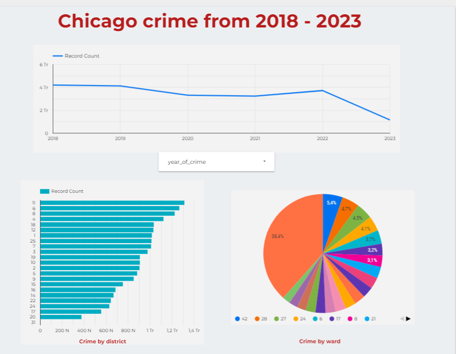
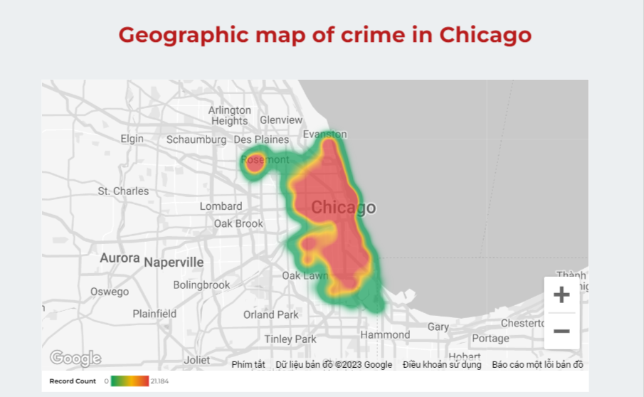

# elt_data_pipeline

## **Dataset**

This dataset reflects reported incidents of crime (with the exception of murders where data exists for each victim) that occurred in the City of Chicago from 2001 to present, minus the most recent seven days. 

Data is extracted from the Chicago Police Department's CLEAR (Citizen Law Enforcement Analysis and Reporting) system. In order to protect the privacy of crime victims, addresses are shown at the block level only and specific locations are not identified. Should you have questions about this dataset, you may contact the Data Fulfillment and Analysis Division of the Chicago Police Department at DFA@ChicagoPolice.org. 

**Disclaimer**: These crimes may be based upon preliminary information supplied to the Police Department by the reporting parties that have not been verified. The preliminary crime classifications may be changed at a later date based upon additional investigation and there is always the possibility of mechanical or human error. Therefore, the Chicago Police Department does not guarantee (either expressed or implied) the accuracy, completeness, timeliness, or correct sequencing of the information and the information should not be used for comparison purposes over time. The Chicago Police Department will not be responsible for any error or omission, or for the use of, or the results obtained from the use of this information. 

The user specifically acknowledges that the Chicago Police Department is not responsible for any defamatory, offensive, misleading, or illegal conduct of other users, links, or third parties and that the risk of injury from the foregoing rests entirely with the user. The unauthorized use of the words "Chicago Police Department," "Chicago Police," or any colorable imitation of these words or the unauthorized use of the Chicago Police Department logo is unlawful.

### Dataset description
Our dataset is taken from Kaggle spanning five years of data. It contains around a million records and 23 columns.
1. ID: Unique identifier for the record.
2. Date: Date when the incident occurred. this is sometimes a best estimate.
3. Primary_type: The primary description of the IUCR code.
4. Description: The secondary description of the IUCR code, a subcategory of the primary description.
5. Location_description: - Description of the location where the incident occurred.
6. Arrest: Indicates whether an arrest was made.
7. Beat: Indicates the beat where the incident occurred. A beat is the smallest police geographic area – each beat has a dedicated police beat car. Three to five beats make up a police sector, and three sectors make up a police district. The Chicago Police Department has 22 police districts.
8. District:Indicates the police district where the incident occurred.
9. Ward: The ward (City Council district) where the incident occurred.
10. Community_area: Indicates the community area where the incident occurred. Chicago has 77 community areas.
11. Year: Year the incident occurred.
12. Latitude: The latitude of the location where the incident occurred.
13. Longitude: The longitude of the location where the incident occurred.
14. Location: The location where the incident occurred in a format that allows for creation of maps and other geographic operations on this data portal.

## ELT architecture

### Technology used:
- Docker : used with prefect cloud
- Prefect: data orchestration tool
- Google cloud storage: data lake
- Google bigquery: data warehouse
- dbt cloud: transformation tool
- Looker studio: BI tools

## Report link
Check out [this link](https://lookerstudio.google.com/s/lfme9eZq-Ys) for more details.

